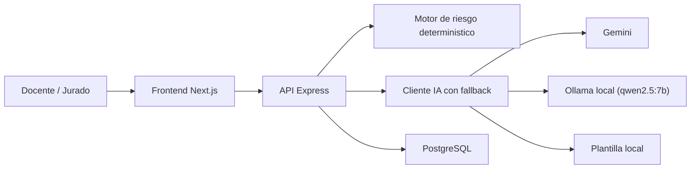

# Radar Escolar

Dashboard para docentes que detecta estudiantes en riesgo de bajo rendimiento o desercion a partir de su seguimiento semanal y genera una recomendacion de intervencion personalizada y explicable. La solucion fue construida para el Hackathon EPIS XXI, y este README esta pensado tambien como documento de sustentacion tecnica para jurado.

La demo usa nombres ficticios y contexto socioeducativo simulado. El riesgo se calcula solo con senales academicas y de asistencia; el contexto se usa unicamente para adaptar el apoyo recomendado.

Ver tambien [PLAN.md](PLAN.md).

## Propuesta

Radar Escolar ayuda al docente a responder tres preguntas:

1. Que estudiantes necesitan revision prioritaria.
2. Que senal concreta disparo la alerta.
3. Que accion se puede tomar esta semana sin estigmatizar al estudiante.

## Stack

- Frontend: Next.js 15.5.18 (App Router) + React 18 + Tailwind CSS, en `frontend/`.
- Backend: Express + Node.js, en `backend/`.
- Base de datos: PostgreSQL, con cliente `pg` directo.
- IA: estrategia configurable por `AI_MODE`. Por defecto es `cloud-first`: intenta `Gemini` si hay API key, luego `Ollama` local con `qwen2.5:7b`, y finalmente plantilla local.

## Arquitectura

### Vista general



### Arquitectura frontend

- Usa App Router de Next.js con renderizado del lado del servidor para las vistas principales.
- `/` muestra el tablero resumen con conteos de riesgo y tarjetas de estudiantes.
- `/estudiantes/[id]` muestra el detalle: perfil, evolucion semanal, senales detectadas, contexto de apoyo y recomendacion.
- `/configuracion` muestra el modo activo de IA, orden de proveedores, umbrales de riesgo y limites de uso.
- El acceso al backend esta centralizado en [`frontend/lib/api.ts`](frontend/lib/api.ts), que define los tipos de datos usados por la UI.
- El frontend no calcula el riesgo principal; consume el riesgo ya resuelto por el backend para mantener una sola fuente de verdad.

### Arquitectura backend

- [`backend/server.js`](backend/server.js) expone la API REST y el `healthcheck`.
- [`backend/routes/estudiantes.js`](backend/routes/estudiantes.js) concentra los endpoints de consulta y recomendacion.
- [`backend/routes/config.js`](backend/routes/config.js) expone configuracion de solo lectura para la pantalla `/configuracion`.
- [`backend/lib/riskEngine.js`](backend/lib/riskEngine.js) implementa la regla de riesgo deterministica.
- [`backend/lib/aiClient.js`](backend/lib/aiClient.js) encapsula la generacion de recomendaciones con fallback configurable.
- [`backend/prompts/radarSystemPrompt.js`](backend/prompts/radarSystemPrompt.js) define las restricciones eticas y de seguridad de uso para la IA.
- [`backend/db/seed.js`](backend/db/seed.js) genera un dataset reproducible para la demo.

### Flujo de datos

1. El frontend solicita lista o detalle de estudiantes al backend.
2. El backend consulta PostgreSQL y agrupa historial por estudiante.
3. El motor de riesgo compara primeras 2 semanas vs ultimas 2 semanas.
4. Si el usuario solicita recomendacion, el backend arma un prompt estructurado.
5. La recomendacion sigue el orden configurado por `AI_MODE` o `AI_PROVIDER_ORDER`. En `cloud-first`, intenta `Gemini`; si no hay API key o falla, intenta `Ollama qwen2.5:7b`; si tampoco está disponible, cae a una plantilla local.
6. La UI muestra la recomendacion junto con la fuente que respondio: `gemini`, `ollama` o `plantilla-local`.

## Base de datos

### Motor y enfoque

- Motor: PostgreSQL.
- Acceso: cliente `pg` sin ORM.
- Modelo: 2 tablas relacionales.
- Carga de demo: seed deterministico para que el jurado vea siempre el mismo escenario.

### Modelo logico

- `estudiantes`: datos generales y contexto de apoyo.
- `seguimiento_semanal`: serie temporal academica por semana.
- Relacion: `estudiantes.id 1:N seguimiento_semanal.estudiante_id`.

### Esquema

El esquema operativo esta en [`backend/db/schema.sql`](backend/db/schema.sql) y se deja un espejo de lectura rapida en [`db/schema.sql`](db/schema.sql).

## Diccionario de datos

### Tabla `estudiantes`

| Campo | Tipo | Descripcion | Uso en el sistema |
|---|---|---|---|
| `id` | `SERIAL` | Identificador del estudiante | PK y relacion con seguimiento |
| `nombre_ficticio` | `VARCHAR(100)` | Nombre ficticio para demo | Presentacion en UI |
| `grado` | `VARCHAR(20)` | Grado academico | Segmentacion visual |
| `seccion` | `VARCHAR(10)` | Seccion del aula | Segmentacion visual |
| `clasificacion_socioeconomica` | `VARCHAR(20)` | `no_pobre`, `pobre`, `pobre_extremo` | Solo adapta la recomendacion; no calcula riesgo |
| `internet_en_casa` | `BOOLEAN` | Disponibilidad de internet | Adapta el tipo de apoyo |
| `lengua_materna` | `VARCHAR(50)` | Idioma predominante | Ayuda a sugerir acompanamiento pertinente |
| `distancia_a_escuela_km` | `NUMERIC(5,2)` | Distancia aproximada al centro educativo | Contexto logistico |
| `observacion_docente` | `TEXT` | Nota cualitativa del docente | Contexto adicional para la recomendacion |
| `situacion_laboral_familiar` | `VARCHAR(120)` | Situacion economica/laboral del hogar | Contexto de apoyo |
| `costo_estudio_mensual` | `NUMERIC(7,2)` | Estimacion de gasto mensual | Contexto de barreras |
| `estudiante_trabaja` | `BOOLEAN` | Si el estudiante realiza actividad laboral | Ajuste de intervencion |
| `problemas_salud_antecedentes` | `TEXT` | Antecedentes reportados, no diagnosticos | Coordinacion respetuosa, no uso medico |
| `es_foraneo` | `BOOLEAN` | Si vive fuera del entorno local inmediato | Ajuste de seguimiento |

### Tabla `seguimiento_semanal`

| Campo | Tipo | Descripcion | Uso en el sistema |
|---|---|---|---|
| `id` | `SERIAL` | Identificador del registro semanal | PK |
| `estudiante_id` | `INTEGER` | Referencia a `estudiantes.id` | FK |
| `semana` | `INTEGER` | Numero de semana observada | Orden temporal |
| `asistencia_pct` | `NUMERIC(5,2)` | Porcentaje de asistencia | Variable de riesgo |
| `promedio_notas` | `NUMERIC(4,2)` | Promedio academico en escala 0-20 | Variable de riesgo |
| `comprension_lectora` | `NUMERIC(4,2)` | Resultado de comprension en escala 0-20 | Variable de riesgo |
| `participacion_score` | `INTEGER` | Participacion en escala 1-5 | Variable de riesgo |
| `tareas_entregadas_pct` | `NUMERIC(5,2)` | Porcentaje de tareas entregadas | Variable de riesgo |

### Criterio de sensibilidad de datos

- Datos mostrados en la demo: ficticios o simulados.
- Datos sensibles o potencialmente sensibles: contexto socioeconomico, salud, lengua, trabajo y procedencia.
- Regla de negocio clave: estos campos no elevan ni justifican el nivel de riesgo; solo ayudan a personalizar el apoyo.

## Regla de riesgo

La clasificacion es deterministica y explicable. No usa ML.

- Compara el promedio de las primeras 2 semanas contra el promedio de las ultimas 2 semanas.
- Evalua 5 senales: asistencia, notas, comprension lectora, participacion y tareas entregadas.
- Nivel interno: `Alto` si hay 2 o mas senales, `Medio` si hay 1, `Bajo` si no hay senales activas.

| Senal | Umbral de alerta |
|---|---|
| Asistencia | Caida mayor a 15 puntos porcentuales |
| Notas | Caida mayor a 2 puntos |
| Comprension lectora | Caida mayor a 2 puntos |
| Participacion | Caida mayor a 1.5 puntos |
| Tareas entregadas | Caida mayor a 20 puntos porcentuales |

El backend tambien identifica la semana de mayor caida para citar el dato que justifica la recomendacion, por ejemplo `[Semana 6]`.

## API principal

| Metodo | Ruta | Descripcion |
|---|---|---|
| `GET` | `/api/health` | Verifica que el backend este operativo |
| `GET` | `/api/config` | Devuelve modo de IA, umbrales de riesgo y limites de uso |
| `GET` | `/api/estudiantes` | Devuelve tablero resumen por estudiante |
| `GET` | `/api/estudiantes/:id` | Devuelve perfil, historial y riesgo |
| `POST` | `/api/estudiantes/:id/recomendacion` | Genera recomendacion con fallback |

## IA y explicabilidad

### Estrategia recomendada para la demo

Modo por defecto: `cloud-first`

1. Gemini (`gemini-2.5-flash`)
2. Ollama local (`qwen2.5:7b`)
3. Plantilla local deterministica

Modo opcional: `hybrid`

1. Ollama local (`qwen2.5:7b`)
2. Gemini (`gemini-2.5-flash`)
3. Plantilla local deterministica

Modo opcional: `offline`

1. Ollama local (`qwen2.5:7b`)
2. Plantilla local deterministica

Esto evita que la demo se rompa por falta de conectividad, caida del modelo o respuesta invalida. En la configuracion por defecto se prioriza Gemini si `GEMINI_API_KEY` existe; si no existe, salta automaticamente a Qwen/Ollama y luego a la plantilla local.

### Restricciones eticas del prompt

La recomendacion esta gobernada por reglas explicitas:

- El riesgo se calcula solo con indicadores academicos y de asistencia.
- Pobreza, lengua, salud, trabajo, distancia o procedencia no son causa de riesgo.
- La IA no diagnostica, no culpabiliza y no etiqueta al estudiante.
- Si hay antecedentes de salud, solo sugiere coordinacion institucional o familiar.
- Si hay senales activas, debe citar la semana que sustenta la accion.

## Seguridad

### Seguridad implementada en la demo

- Configuracion por variables de entorno: `AI_MODE`, `AI_PROVIDER_ORDER`, `GEMINI_API_KEY`, `DATABASE_URL`, `CORS_ORIGINS`, `RECOMMENDATION_RATE_LIMIT_MAX` y `NEXT_PUBLIC_API_URL`.
- Consultas parametrizadas en PostgreSQL en los endpoints que reciben `id`.
- Validacion de `id` entero positivo en endpoints de detalle y recomendacion.
- CORS restringido por `CORS_ORIGINS`.
- Limite de cuerpo JSON de `100kb`.
- Headers basicos de seguridad: `X-Content-Type-Options`, `Referrer-Policy` y `Permissions-Policy`.
- Rate limiting simple para la ruta de recomendacion.
- DTO de salida para evitar devolver filas crudas completas.
- Minimizacion de salud hacia IA: no se manda el antecedente textual completo, solo si existe antecedente registrado.
- Separacion entre frontend y backend: la API key de Gemini no vive en el cliente.
- Nombres ficticios y dataset simulado para evitar exposicion de datos reales.
- Guardrails en el prompt para impedir uso discriminatorio de variables sensibles.
- Respaldo local con Ollama para seguir operando si Gemini no está disponible.

### Brechas conocidas de esta version

- No hay autenticacion ni autorizacion; se asume un unico docente en contexto demo.
- No hay auditoria de accesos ni trazabilidad de acciones por usuario.
- La cache de recomendaciones esta en memoria y se pierde al reiniciar el servidor.
- No hay HTTPS/TLS configurado desde la app; en produccion debe resolverse en proxy/plataforma.
- `npm audit` del frontend puede reportar vulnerabilidad moderada transitiva de `postcss` dentro de Next.js; no queda vulnerabilidad alta tras actualizar a Next 15.5.18.

### Endurecimiento recomendado para produccion

1. Autenticacion con sesiones o JWT y roles por docente/directivo.
2. Politica CORS cerrada por dominio.
3. Rate limiting y cuotas por usuario para endpoints de IA.
4. Cifrado de secretos, rotacion de claves y vault de configuracion.
5. Logs de auditoria, monitoreo y alertas.
6. Politicas de minimizacion y retencion de datos personales.

## Requisitos

- Node.js 18+
- Docker
- Ollama local con `qwen2.5:7b` si quieres respaldo offline
- Opcional: `GEMINI_API_KEY` para usar Gemini en `cloud-first` o `hybrid`

## Arranque

### 1. Base de datos

```bash
docker run --name radar-db -e POSTGRES_PASSWORD=hackathon -p 5432:5432 -d postgres
```

Si el contenedor ya existe:

```bash
docker start radar-db
```

### 2. Backend

```bash
cd backend
cp .env.example .env
npm install
docker exec -i radar-db psql -U postgres -d postgres < db/schema.sql
npm run seed
npm run dev
```

Backend disponible en `http://localhost:3001`.

Si quieres que el respaldo local funcione cuando no haya internet o Gemini falle, inicia Ollama en tu máquina y descarga el modelo una vez:

```bash
ollama serve
ollama pull qwen2.5:7b
```

La configuracion por defecto del backend prioriza `Gemini` con `AI_MODE=cloud-first` si `GEMINI_API_KEY` esta configurada; si no, usa `Ollama` como respaldo y finalmente la plantilla local.

Si quieres actualizar solo el contexto extendido:

```bash
docker exec -i radar-db psql -U postgres -d postgres < db/hackathon_context_update.sql
npm run seed
```

### 3. Frontend

```bash
cd frontend
cp .env.example .env
npm install
npm run dev
```

Frontend disponible en `http://localhost:3000`.

## Archivos utiles para evaluacion

- [`README.md`](README.md): resumen tecnico y funcional.
- [`PLAN.md`](PLAN.md): decisiones de producto y construccion.
- [`db/schema.sql`](db/schema.sql): espejo del esquema SQL para lectura rapida.
- [`db/evaluacion.sql`](db/evaluacion.sql): consulta resumen por estudiante.
- [`backend/lib/riskEngine.js`](backend/lib/riskEngine.js): regla explicable de riesgo.
- [`backend/prompts/radarSystemPrompt.js`](backend/prompts/radarSystemPrompt.js): restricciones eticas de IA.

## Alcance no incluido en esta demo

- Sin autenticacion real.
- Sin bitacora persistente de observaciones; el componente existe como mock visual.
- Sin agenda real para la accion de orientacion.
- Sin despliegue productivo ni observabilidad operativa completa.
